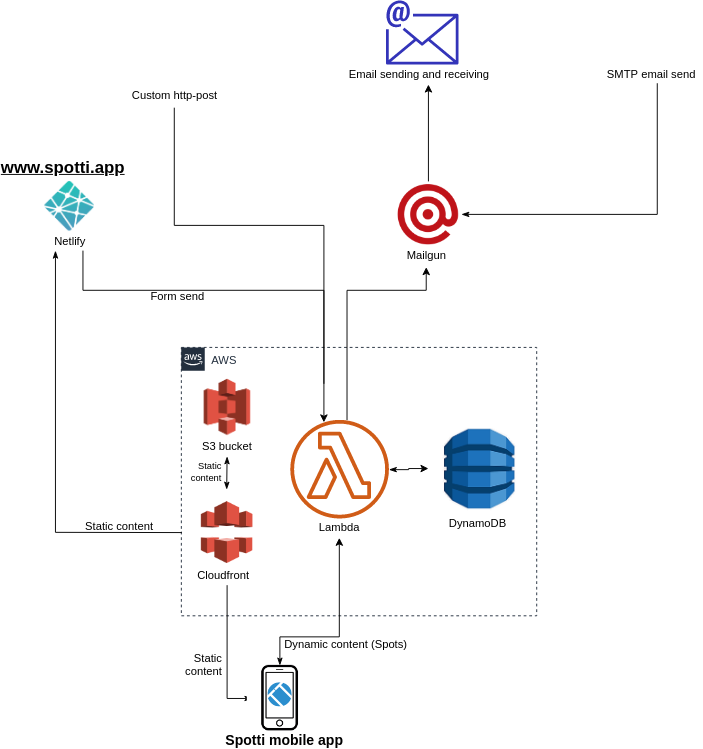
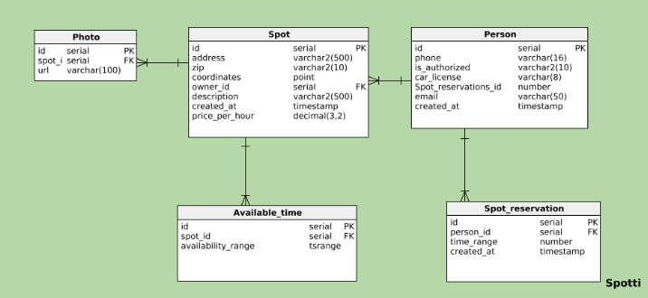

# spotti

www.spotti.app (It will deactivate on the summer of 2020)

This is an unfinished product. [It worked like this when connected to the AWS](https://youtu.be/XDTpCvA8ONc) and it currently does not work properly without a connection to AWS. All the api-keys have been deactivated.

The project was up and running and usable using a built apk-file although the actual reservations were not stored anywhere. This project was posted just as a showcase. 

Here is an overview of the architecture:

An initial relational database schema:

